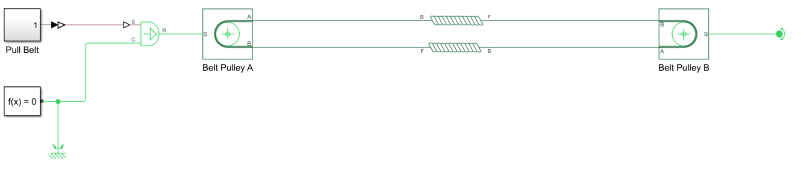

# ProcessWhisperer
Process optimizer that leverages the power of Reinforcement Learning (RL) to automatically fine-tune and optimize machine process parameters. By harnessing machine learning, the algorithm intelligently explores the parameter space to maximize process performance, enabling efficient and high-quality production. Use at the moment this two parameters for initialise the simulation `t_sim = 10;v_in = 4;`
## Initial model
The simplified model provided to us is shown below.

 

*(img 1) Representation of model components in Simulink*

In image 1 there are 2 pulleys connected by an ideal cable, in which a traction force generated by pulley A (driving pulley) is applied.
Therefore pulley A, turning at a certain input speed v_in, manages to make pulley B move.
The speed graph is shown in image 3.

*(img 2) Representation of the 3D model of image 1*

*(img 3) Graph of the speeds coming out*

This graph rappresent the speeds coming out of the out.v component of img 1 with model input values `t_sim = 10` and `v_in = 4`, where `t_sim` indicates the simulation time, while `v_in` the force passed to Pulley A1.

## Introduction of a third pulley

*(img 4)*

In image 4 it shows how we added a third pulley (pulley C), spinning it via the same wire that connects pulley A to pulley B.
The pulley C introduced is therefore not driving, but rotates thanks to the force present on the cable generated by pulley A.
The distance that is present between A and C is determined by a parameter set by code.

*(img 5) Representation of the 3D model of image 4*

*(img 6) Graph of the speeds coming out of pulley B*

*(img 7) Graph of the speeds coming out of pulley C*

In Images 6 and 7 the speeds of pulleys B and C are shown given, as input values, `t_sim = 10` and `v_in = 4`. It can be noted that unlike the version of the two-pulley model, the speed has decreased by about ten of units approximately.
This decrease in speed is given by the fact that with the same force exerted by pulley A the speed on C decreases, in fact in the 3 pulley model part of the force is dispersed to move pulley C.

## Introduction to a real 2-pulley model

The new model is composed of two belt pulleys, which represent two real pulleys whose size can be variable and the contact between the belt and the pulley is ideal. A rotation speed in radians is transmitted to pulley A as input, while pulley B is free in its rotation. The two pulleys are connected to each other by a cable on which two variables stiffness and dumping can be set as parameters.
