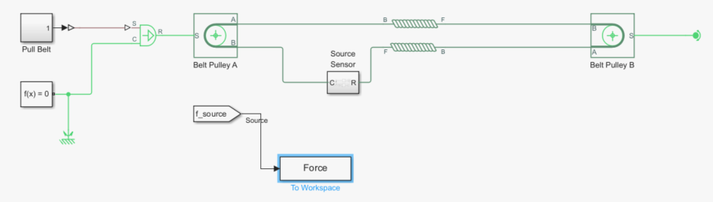
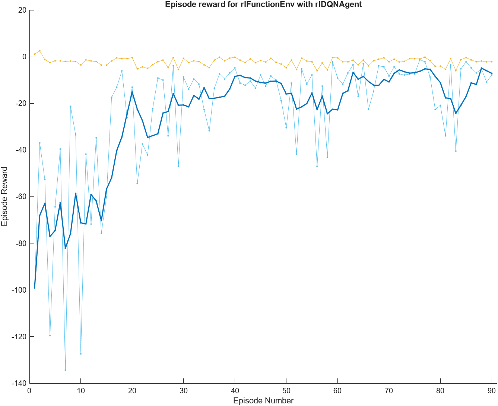
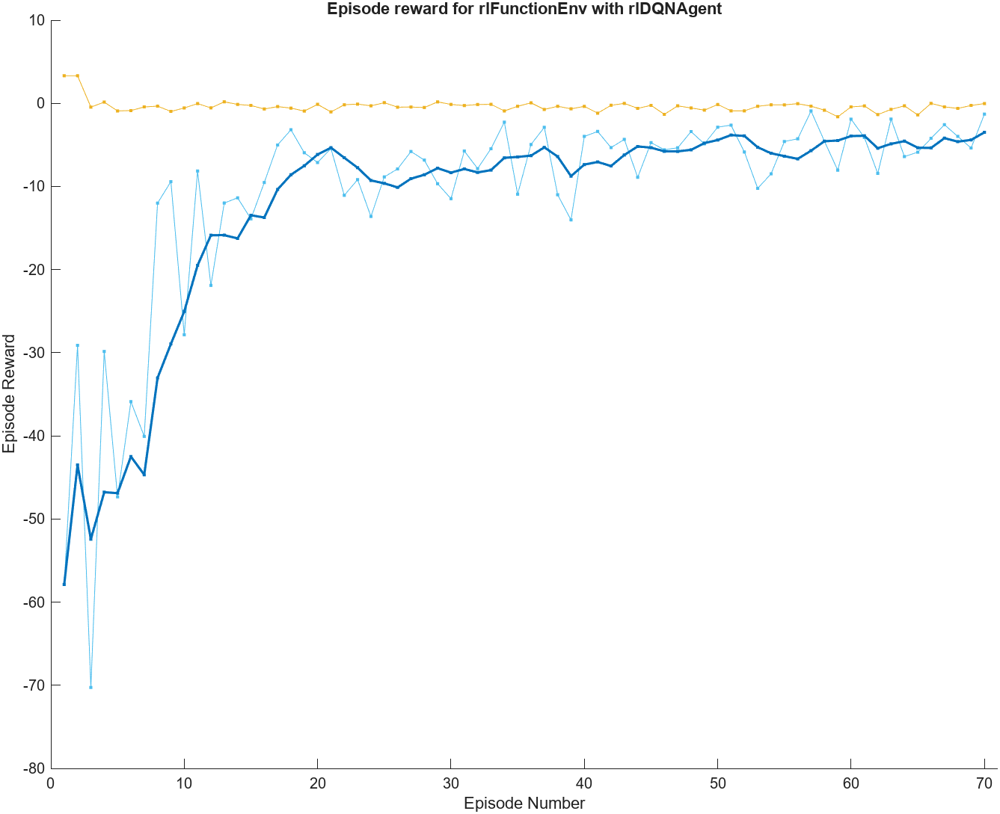
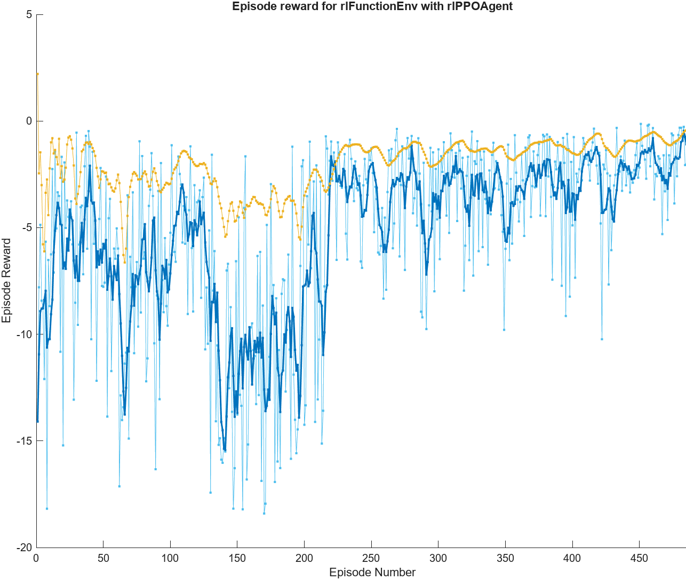
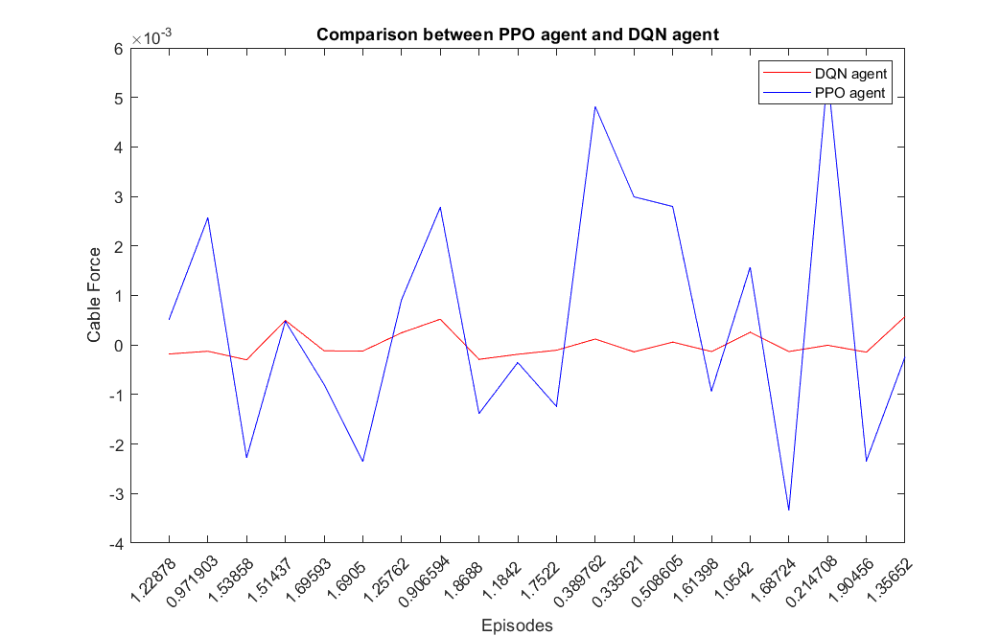

# Image of the model in Simulink #

    

# Version of agent 1.0 #
## Goal ##
In the first example of RL application associated with this model we decided to try to simulate this pulley system by passing a constant value of angular velocity of pulley A. Our objective was therefore to try to create an agent capable of establishing the stiffness (durability) best for the cable, ignoring the dumping value for now, so as to obtain the lowest non-negative force at the end of the simulation in the cable.
## Environment ##
To solve this first objective we decided to use a continuous observation set composed of the value of the cable stiffness and the value of the maximum force at the end of the simulation.
During the resetFunction the environment initializes the following values:
* Rotation speed of pulley A, `const_rot = 1`
* Cable stiffness, `stiffness = random integer between 10 and 30`
The assignment of the Reword occurs via the -abs(max_force_cable) function, thus allowing us to continuously determine the distance from our objective, which will be to obtain a reward as close to 0 as possible.
## Agent ##
As an agent we chose to use a DQN Agent, which therefore forced us to discretize the set of actions that the agent can perform. We therefore decided to assign as possible operations:
* Increase in stiffness (by one unit)
* Decrease in stiffness (by one unit)
* Stationing of stiffness

## Agent's options ##

`agentOpts.EpsilonGreedyExploration.Epsilon = 1;` 

`agentOpts.EpsilonGreedyExploration.EpsilonMin = 0.001;`

`agentOpts.EpsilonGreedyExploration.EpsilonDecay = 0.01;`

`agentOpts.CriticOptimizerOptions.LearnRate = 0.01;`

`agentOpts.DiscountFactor = 0.1;`

We have included an exploration factor to ensure that the agent can try more actions than usual.
The EpsilonDecay (discount factor) has been set to a value of 0.1 to ensure that the agent learns more from the step itself than from a subsequent action.

## Neural network ##
The structure of the adopted neural network is composed of 3 layers: 1 input, 1 hidden layer (64 nodes) and 1 output layer.
We used an almost low number due to the presence of few input parameters. The activation functions used are the Relu.

 

## Training ##
The model was trained with a number of episodes equal to 90 and with a maximum number of steps per episode of 30.

 

## Conclusions ##
Starting from the training we can see how the trained agent achieved an average reward of -7.
This data suggests that we have arrived at a good result, albeit allowing a margin of error, but this does not represent an obstacle for the continuation of the research at this stage.

The simulation is not always satisfactory due to some issues such as the accuracy and precision of the result and we assume that the causes could be:
* The low presence of randomness makes it difficult for the neural network to calculate the best action.
* A poorly configured neural network
* Agent hyperparameters not suited to the problem
* The choice of the DQN agent limits the setting of discrete actions and this leads to low model accuracy.
* The low number of steps per episode and the low number of train episodes certainly limit the agent's learning.

# Version of agent 1.1 #

Differences compared to version 1.0:

* Introduction of a random rotation speed associated with pulley A between 0.5 and 2.
* Greater discretization in the actions that our agent can perform, increase in the possible increase values and decrease in the stiffness values.

 

## Conclusions ##

Unlike model 1.0, we are able to obtain a more accurate stiffness result in a smaller number of steps, probably thanks to the greater discretization of the agent's actions.
Furthermore we can see that the addition of a new variable such as the rotation speed of the pulley did not negatively affect the agent's learning.

# Version of agent 2.0 #

In this version the model is based on PPO algorithm.
The choice of the PPO algorithm was made based on the presence of continuous actions, the main difference between 1.1 and 2.0.

## Goal ##
The goal is the same of the previuos agent but with continous actions.
## Environment ##
The enviroment is the same of 1.1 but now the actions are continous.
During the resetFunction the environment initializes the following values:
* Rotation speed of pulley A, `const_rot = 0.2 + (2 - 0.2) * rand()`
* Cable stiffness, `stiffness = random integer between 10 and 30`
## Agent ##
As an agent we chose to use a PPO Agent, which allowed us to set both observations and actions to a continuous set.

## Neural network ##

Since the PPO algorithm is based on the actor-critic model, it was necessary to develop two different neural networks.

### Critic ###
The first network is the one for critics. The network must have as many input layers as there are environment observation channels and a single output layer that returns a scalar value, the two hidden layers have 32 nodes.

 

### Actor ###

The second network is for the actor. The network must have as many input layers as there are observation channels in the environment (with each input layer receiving input from an observation channel). The network must have two output levels, each with as many elements as the size of the action space. The two output levels return the mean and standard deviation of each component of the action. The actor will use these layers to represent the Gaussian probability distribution from which the action will be sampled.

 

## Training ##
The model was trained with a number of episodes equal to 500.

 

## Conclusions ##

The resulting agent presents a medium level performance, although it does not reach a level of excellence, it still maintains adequate functionality. When we compare the PPO agent (2.0) to the DQN agent (1.1), we observe a decrease in accuracy.

This discrepancy can be attributed, with high probability, to the absence of effective hyperparameter optimization.
Therefore, the next step in our development process will necessarily include the implementation of a hyperparameter tuning tool, in order to improve the performance of the agent.
