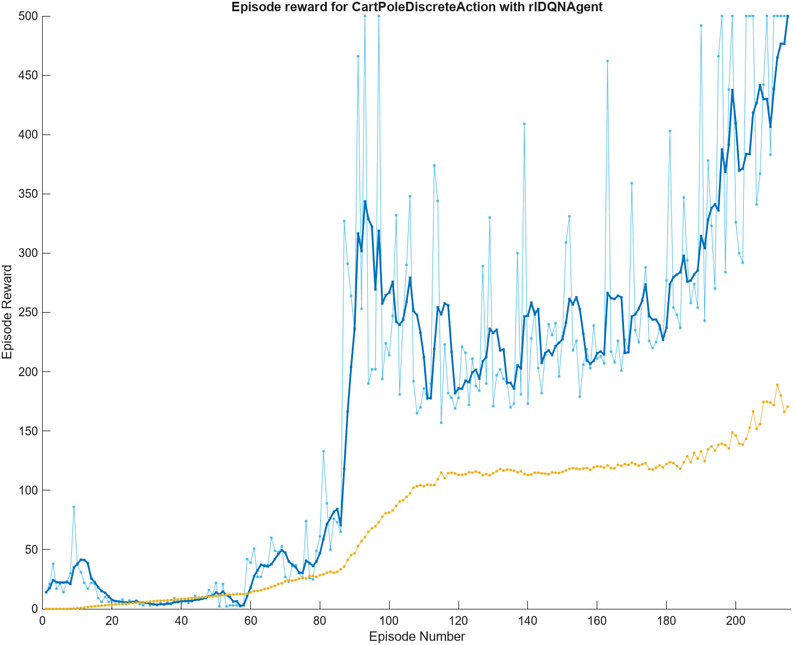
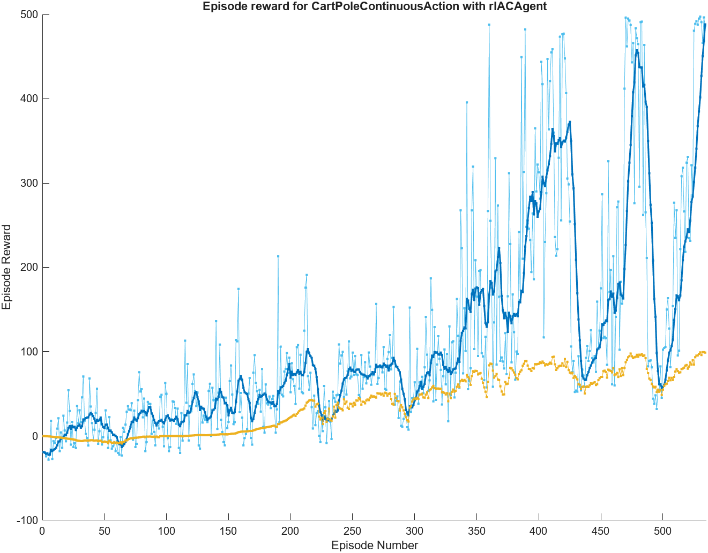
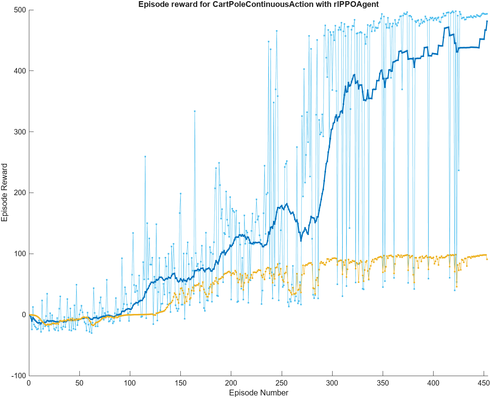
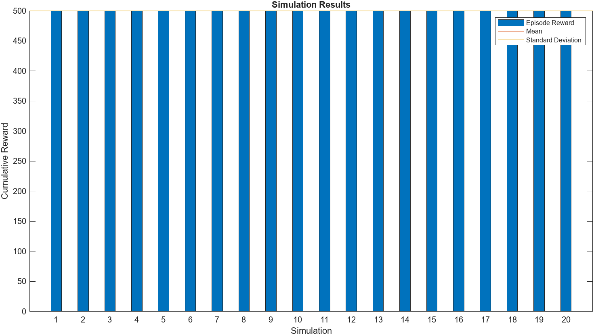

# CART POLE
Problem definition: https://www.gymlibrary.dev/environments/classic_control/cart_pole/

## Definition of the environment
To solve the problem we used two different environments respectively, the first composed of a discrete set of actions that the agent can perform and a second composed instead of a continuous set of actions

- Discrete environment:
```
env = rlPredefinedEnv("CartPole-Discrete");
```

- Continuos environment:
```
env = rlPredefinedEnv("CartPole-Continuous");
```

## Definition of agents
Three different agents were used to solve the problem:
- DQN agent to resolve the discrete environment (`rlDQNAgent`)
- AC agent to resolve the continuous environment (`rlACAgent`)
- PPO agent to resolve the continuous environment (`rlPPOAgent`)

## Train 
Results of training the three agents in their respective environments.







## Conclusions
All three agents manage to reach convergence and manage to obtain maximum precision and accuracy in subsequent simulations.



However, we can notice some differences in the training of the different agents, such as the total number of episodes necessary for the agent to reach the final state. This is certainly due to the different algorithm applied and the different hyperparameters inserted for each agent.
