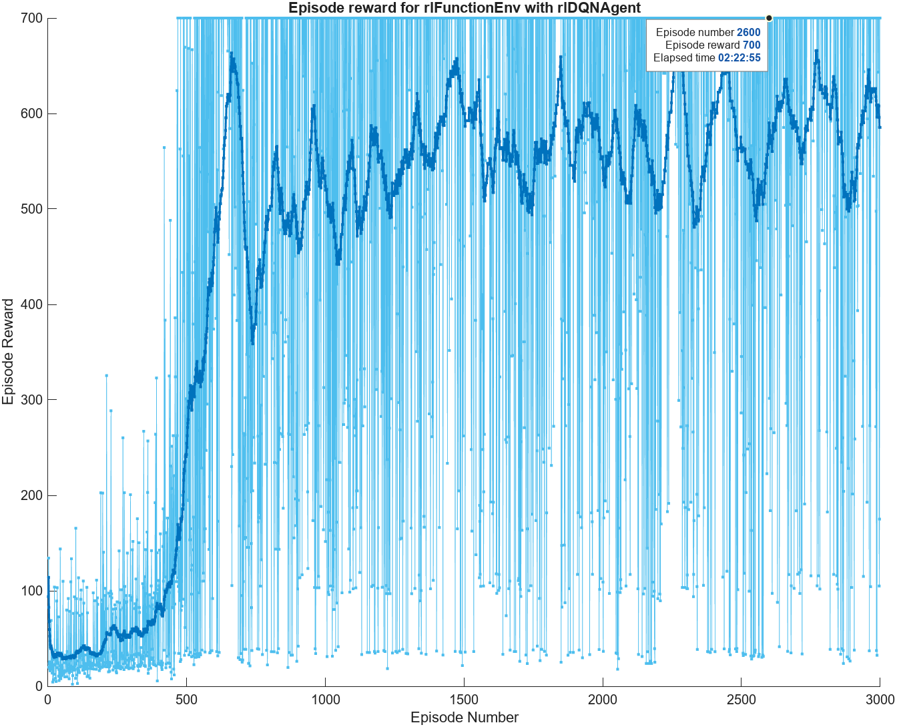
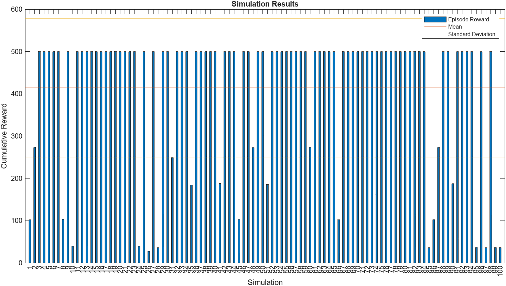

# Pong Single Player
## Status (Observation):
The game state variables are as follows:
- `yBar`: Vertical coordinate (height) of the bar.
- `xBall`: Horizontal coordinate (length) of the ball.
- `yBall`: Vertical coordinate (height) of the ball.
- `theta`: Angle of movement of the ball (between 0° and 360°).

## Action:
The agent can take one of the following actions:
- `0`: The bar remains stationary.
- `0.7`: The bar moves up by 0.7 units.
- `-0.7`: The bar moves down by 0.7 units.

## Rules of the game
- The size of the playing field is **30 x 30 units**.
- The bar is located on the left side of the playing field, with its starting center point at coordinates (2, 15).
- The bar has a **height of 5 units** and a thickness of **1 unit**.
- The ball starts at point (15, 15) and can move in an angle between **0° and 15°** and between **315° and 360°**.
- At each step, the ball moves **1 unit** with the angle `theta`.

# Workflow
## Phase 1 - Definition of observations and actions
```
obsInfo = rlNumericSpec([4 1]);
obsInfo.Name = "Pong States";
obsInfo.Description = 'yBar, xBall, yBall, theta';
actInfo = rlFiniteSetSpec([-0.7 0 0.7]);
actInfo.Name = "Pong Action";
```
`obsInfo` (observations) are continuous set while `actInfo` (actions) are discrete set

## Phase 2 - Definition of the environment (ResetFunction and StepFunction)
The `resetFunction` and the `stepFunction` are essential in the definitions of the environment as they are useful respectively for: resetting the state variables of the environment and for calculating the action to be performed in the next step of the execution, calculating the reward.

The game logic and consequently the reward that is given to the agent have been inserted into our stepFunction.
The reward is positive (+1) if during each step that the ball travels through the space the game does not end due to a defeat.
In the event that the ball hits the wall which causes a loss, the agent is given a negative reward (-20) but removes an additional reward proportionate to the distance between the bar and the point where the ball hit.

*Important note: Probably due to an inefficient reward setting, it affects the accuracy of the agent and therefore the final simulation.*

## Phase 3 - Definition of the neural network
Definition of a simple neural network composed of a fullyConnected Layer and a ReLU function necessary to introduce nonlinearity into our model.
```
 net = [featureInputLayer(obsInfo.Dimension(1))
   fullyConnectedLayer(32)
   reluLayer
   fullyConnectedLayer(length(actInfo.Elements))
 ];
criticNet = dlnetwork(net);
critic = rlVectorQValueFunction(net, obsInfo, actInfo);
```

## Phase 4 - Definition of the agent and hyperparameters
It was chosen to use a DQN agent, which exploits the previous neural network for the calculation of the Q-value and for the consequent choice of the action to be performed.

The parameters used were adjusted cyclically at the end of each training, in case we believed it was a failing training. The exploration factor was inserted to make the agent (the bar) perform random actions, initially more marked, maintaining a minimum exploration rate for the entire duration of the training. This allowed us to achieve agent convergence more quickly.

```
agentOpts = rlDQNAgentOptions();
agentOpts.UseDoubleDQN = false;
agentOpts.EpsilonGreedyExploration.Epsilon = 1;
agentOpts.EpsilonGreedyExploration.EpsilonMin = 0.001;
agentOpts.EpsilonGreedyExploration.EpsilonDecay = 0.001;
agentOpts.CriticOptimizerOptions.LearnRate = 1e-03;
agentOpts.DiscountFactor = 0.99;
agent = rlDQNAgent(critic, agentOpts);
```
## Phase 5 - Model training


## Phase 6 - Simulation
We have noticed how the agent is still not able to have maximum precision, in fact only 77% (23 games lost out of 100). In our opinion, the cause may be due to an assignment of a reward that is not too precise and a neural network that is not configured in the best way.


